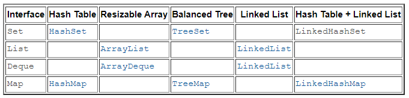
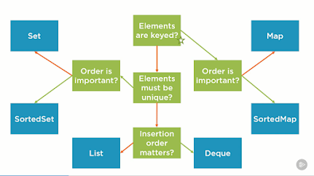
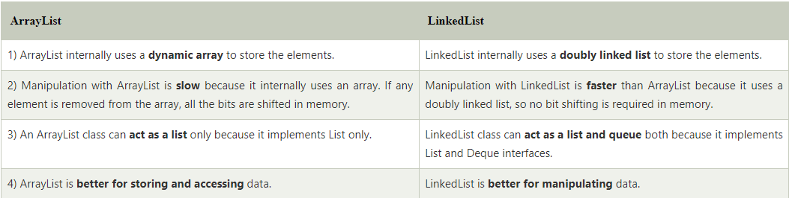
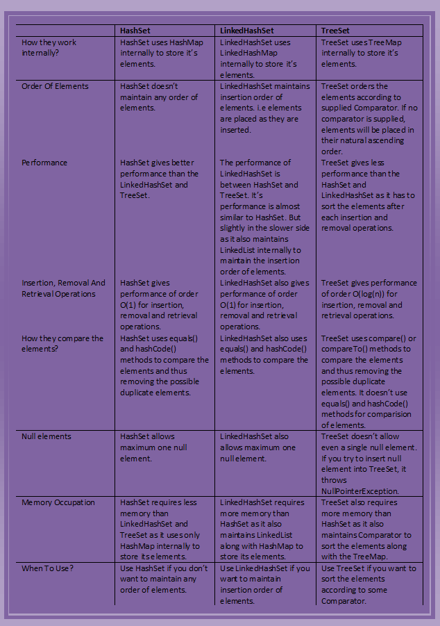

**List** in Java provides **ordered and indexed collection** which **may contain duplicates**. 

ArrayList provides constant time for search operation, so it is better to use ArrayList if searching is more frequent operation than add and remove operation. The LinkedList provides constant time for add and remove operations. So it is better to use LinkedList for manipulation.

**Set** interface provides an **unordered** collection that **doesn't allow duplicates**.

**Map** provides a data structure based on **key-value pair and hashing**.

Suppose you were creating a mapping of names to Person objects. You might want to periodically **output the people in alphabetical order by name. A TreeMap lets you do this.**
A TreeMap also offers a way to, given a name, output the next 10 people. This could be useful for a “More”function in many applications.
**A LinkedHashMap is useful whenever you need the ordering of keys to match the ordering of insertion.** This might be useful in a caching situation, when you want to delete the oldest item.
**Generally, unless there is a reason not to, you would use HashMap.** That is, if you need to get the keys back in insertion order, then use LinkedHashMap. If you need to get the keys back in their true/natural order, then use TreeMap. Otherwise, HashMap is probably best. It is typically faster and requires less overhead.

**Null elements** :

The list allows null elements and you can have many null objects in a List because it also allowed duplicates. Set just allow one null element as there is no duplicate permitted while in Map you can have null values and at most one null key. 

Worth noting is that Hashtable doesn't allow null key or values but HashMap allows null values and one null key.  This is also the main difference between these two popular implementations of Map interface, aka HashMap vs Hashtable. 

