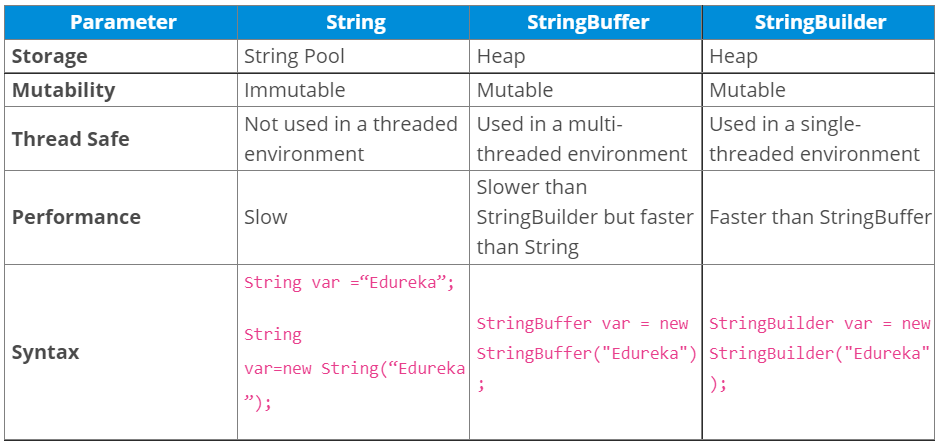

The StringBuilder and StringBuffer class creates a mutable sequence of characters.
Different than String, StringBuilder and StringBuffer are mutable. Both classes create a mutable sequence of characters. And they are very much similar to each other.

StringBufferhas more methods but those methods are in String class as well, thus not implemented in the
newer StringBuilder.

**If you are in a single-threaded environment or don’t care about thread safety, you should use StringBuilder. Otherwise, use StringBuffer for thread-safe operations. ** 
